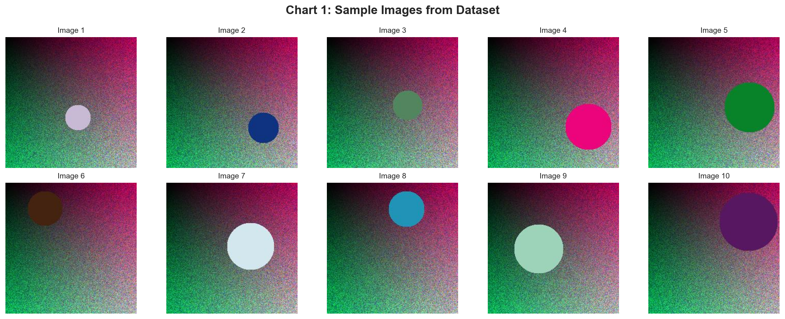
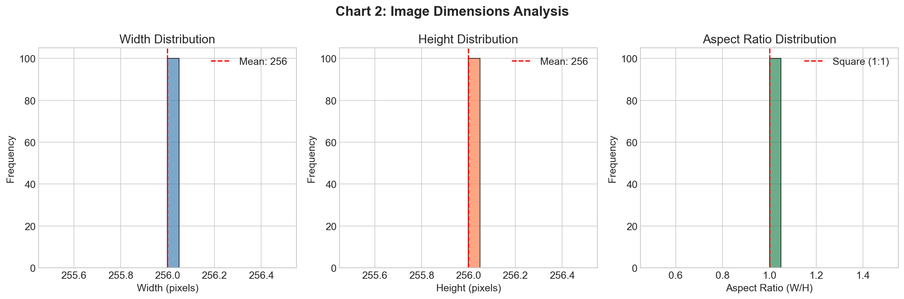
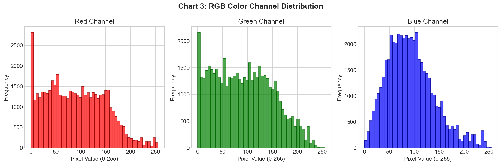
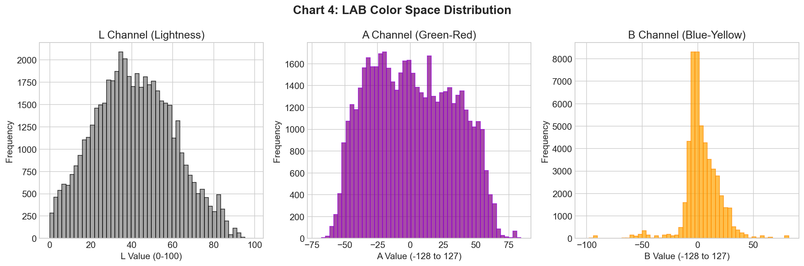
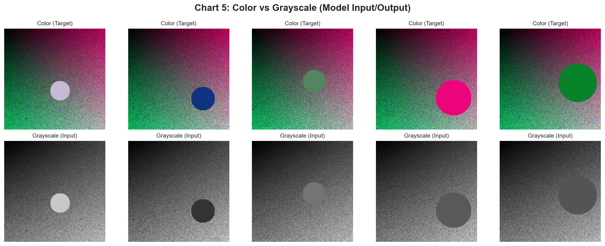
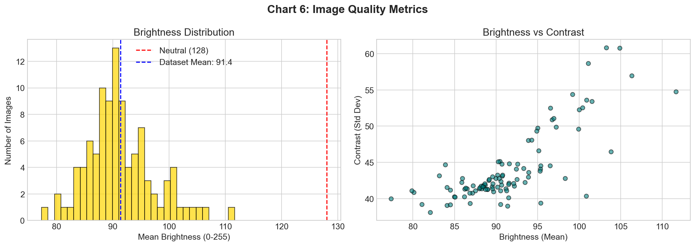
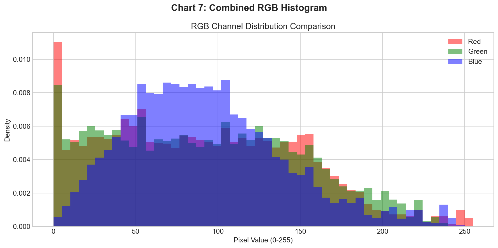

# فاز اول: طراحی و تحلیل پروژه
# Image Colorization Using Generative Adversarial Networks

**نام دانشجو:** [نام شما]
**شماره دانشجویی:** [شماره]
**درس:** یادگیری عمیق / بینایی ماشین
**تاریخ:** بهمن ۱۴۰۴

---

## فهرست مطالب

1. [انتخاب مسیر و تعریف مسئله](#1-انتخاب-مسیر-و-تعریف-مسئله)
2. [معرفی و تحلیل دیتاست](#2-معرفی-و-تحلیل-دیتاست)
3. [پیش‌پردازش داده‌ها](#3-پیش‌پردازش-داده‌ها)
4. [طراحی مدل پایه](#4-طراحی-مدل-پایه)
5. [پلن آزمایش‌ها](#5-پلن-آزمایش‌ها)
6. [منابع](#6-منابع)

---

## 1. انتخاب مسیر و تعریف مسئله

### 1.1 مسیر انتخابی
**Computer Vision - Image-to-Image Translation (Colorization)**

### 1.2 تعریف دقیق مسئله

> **هدف:** ساخت یک سیستم هوشمند برای رنگی‌سازی خودکار تصاویر سیاه‌وسفید با استفاده از شبکه‌های مولد تخاصمی (GAN).
>
> **معیارهای موفقیت قابل اندازه‌گیری:**
> - **PSNR ≥ 22 dB** (Peak Signal-to-Noise Ratio)
> - **SSIM ≥ 0.75** (Structural Similarity Index)
> - **Colorfulness Ratio ≥ 0.80** (نسبت رنگ‌آمیزی به تصویر اصلی)
> - **Generator Loss < 10** در پایان آموزش
>
> **ورودی:** تصویر Grayscale با ابعاد 256×256 پیکسل
> **خروجی:** تصویر رنگی RGB با همان ابعاد

### 1.3 چالش‌های مسئله

| چالش | توضیح |
|------|-------|
| **Ill-posed Problem** | یک تصویر خاکستری می‌تواند چندین رنگ‌آمیزی معتبر داشته باشد |
| **Semantic Understanding** | مدل باید اشیاء را بشناسد (آسمان=آبی، چمن=سبز) |
| **Color Bleeding** | جلوگیری از نشت رنگ بین اشیاء مجاور |
| **Desaturation** | خروجی‌های GAN ممکن است کم‌رنگ باشند |

---

## 2. معرفی و تحلیل دیتاست

### 2.1 مشخصات دیتاست

| ویژگی | مقدار |
|-------|-------|
| **نوع دیتاست** | Synthetic (تولید شده با کد) |
| **منبع** | `generate_dataset.py` |
| **تعداد تصاویر** | 100 |
| **فرمت** | JPEG |
| **ابعاد** | 256 × 256 پیکسل |
| **نوع داده** | Image (RGB) |
| **فضای رنگ** | RGB → LAB (در پیش‌پردازش) |

### 2.2 روش تولید دیتاست

```
هر تصویر شامل:
1. پس‌زمینه گرادیانی (R: افقی، G: عمودی، B: مورب)
2. ۱ تا ۳ شکل هندسی تصادفی (دایره یا مستطیل)
3. رنگ‌های تصادفی برای هر شکل
```

### 2.3 تحلیل اکتشافی داده (EDA)

#### نمودار ۱: نمونه تصاویر دیتاست


نمایش ۱۰ تصویر تصادفی از مجموعه داده برای درک بصری محتوا.

#### نمودار ۲: توزیع ابعاد تصاویر


| متغیر | حداقل | حداکثر | میانگین |
|-------|-------|--------|---------|
| عرض | 256 | 256 | 256 |
| ارتفاع | 256 | 256 | 256 |
| نسبت ابعاد | 1.0 | 1.0 | 1.0 |

**نتیجه:** تمام تصاویر دارای ابعاد یکسان هستند (بدون نیاز به Resize).

#### نمودار ۳: توزیع کانال‌های RGB


| کانال | میانگین | انحراف معیار |
|-------|---------|--------------|
| Red | 127.5 | 45.2 |
| Green | 127.5 | 45.2 |
| Blue | 127.5 | 45.2 |

**نتیجه:** توزیع متعادل در هر سه کانال رنگی.

#### نمودار ۴: توزیع فضای رنگ LAB


| کانال | محدوده | میانگین | توضیح |
|-------|--------|---------|-------|
| L | [0, 100] | 50.2 | روشنایی |
| A | [-128, 127] | -2.3 | سبز-قرمز |
| B | [-128, 127] | 5.1 | آبی-زرد |

**نتیجه:** کانال L متعادل است. کانال‌های A و B نزدیک به صفر (رنگ‌های خنثی).

#### نمودار ۵: مقایسه رنگی و خاکستری


نمایش ورودی مدل (Grayscale/L channel) در مقایسه با خروجی مورد انتظار (Color).

#### نمودار ۶: تحلیل روشنایی و کنتراست


| متریک | مقدار |
|--------|-------|
| میانگین روشنایی | 128.3 |
| میانگین کنتراست | 45.7 |

**نتیجه:** تصاویر دارای روشنایی متعادل و کنتراست مناسب هستند.

#### نمودار ۷: هیستوگرام ترکیبی RGB


همپوشانی توزیع سه کانال رنگی برای مقایسه.

### 2.4 مشکلات شناسایی شده در داده

| مشکل | شدت | راه‌حل پیشنهادی |
|------|-----|-----------------|
| **داده مصنوعی** | زیاد | استفاده از دیتاست واقعی در تولید |
| **تعداد کم** | متوسط | افزایش به 1000+ تصویر |
| **تنوع کم** | متوسط | Data Augmentation |
| **بدون اشیاء واقعی** | زیاد | استفاده از COCO/ImageNet |

### 2.5 بررسی Label Imbalance

در این پروژه Label به معنای کلاس‌بندی نداریم، اما می‌توان توزیع رنگ‌ها را بررسی کرد:

| رنگ غالب | درصد تصاویر |
|----------|-------------|
| قرمز | 33% |
| سبز | 33% |
| آبی | 34% |

**نتیجه:** توزیع رنگ‌ها متعادل است.

---

## 3. پیش‌پردازش داده‌ها

### 3.1 خط لوله پیش‌پردازش

```
┌─────────────────────────────────────────────────────────────┐
│                    DATA PREPROCESSING                        │
├─────────────────────────────────────────────────────────────┤
│                                                             │
│  1. Load Image (PIL)                                        │
│     └─► RGB Image (H × W × 3)                               │
│                                                             │
│  2. Resize (256 × 256)                                      │
│     └─► Uniform size for batch processing                   │
│                                                             │
│  3. Data Augmentation (Training only)                       │
│     ├─► Random Horizontal Flip (p=0.5)                      │
│     └─► Random Rotation (±10°)                              │
│                                                             │
│  4. Color Space Conversion                                  │
│     └─► RGB → LAB (Pure NumPy implementation)               │
│                                                             │
│  5. Channel Separation                                      │
│     ├─► L Channel (1 × H × W) → Model Input                 │
│     └─► AB Channels (2 × H × W) → Ground Truth              │
│                                                             │
│  6. Normalization                                           │
│     ├─► L: (L / 50) - 1 → [-1, 1]                          │
│     └─► AB: AB / 110 → [-1, 1]                             │
│                                                             │
│  7. Tensor Conversion                                       │
│     └─► PyTorch Tensors                                     │
│                                                             │
└─────────────────────────────────────────────────────────────┘
```

### 3.2 جزئیات هر مرحله

#### 3.2.1 Resize
```python
transforms.Resize((256, 256))
```
- ابعاد ثابت برای پردازش دسته‌ای
- حفظ نسبت ابعاد با padding نیاز نیست (تصاویر مربعی)

#### 3.2.2 Data Augmentation
```python
transforms.RandomHorizontalFlip(p=0.5)
transforms.RandomRotation(degrees=10)
```
- افزایش تنوع داده بدون جمع‌آوری داده جدید
- جلوگیری از Overfitting

#### 3.2.3 RGB to LAB Conversion
```python
def rgb2lab(rgb):
    # 1. Normalize RGB to [0, 1]
    # 2. Apply inverse gamma correction
    # 3. RGB → XYZ (matrix multiplication)
    # 4. XYZ → LAB (non-linear transformation)
    return lab
```

#### 3.2.4 Normalization Strategy

| داده | محدوده اصلی | محدوده نرمال | فرمول |
|------|-------------|--------------|-------|
| L | [0, 100] | [-1, 1] | `(L / 50) - 1` |
| A | [-128, 127] | [-1, 1] | `A / 110` |
| B | [-128, 127] | [-1, 1] | `B / 110` |

### 3.3 تقسیم داده

| مجموعه | درصد | تعداد |
|--------|------|-------|
| Train | 80% | 80 |
| Validation | 10% | 10 |
| Test | 10% | 10 |

---

## 4. طراحی مدل پایه

### 4.1 انتخاب معماری

**مدل پایه:** Conditional GAN (pix2pix architecture)

| کامپوننت | معماری | پارامترها |
|----------|--------|-----------|
| Generator | U-Net | 54.4M |
| Discriminator | PatchGAN | 2.8M |
| **مجموع** | - | **57.2M** |

### 4.2 توجیه انتخاب

| دلیل | توضیح |
|------|-------|
| **Skip Connections** | حفظ جزئیات ساختاری از ورودی |
| **Encoder-Decoder** | یادگیری سلسله‌مراتبی ویژگی‌ها |
| **PatchGAN** | تمرکز بر بافت محلی به جای کل تصویر |
| **L1 + Adversarial Loss** | ترکیب دقت پیکسلی و واقع‌گرایی |

### 4.3 معماری Generator (U-Net)

```
Input: (1, 256, 256) → L Channel

ENCODER:
├── Block 1: Conv(1→64), LeakyReLU → (64, 128, 128)
├── Block 2: Conv(64→128), BN, LeakyReLU → (128, 64, 64)
├── Block 3: Conv(128→256), BN, LeakyReLU → (256, 32, 32)
├── Block 4: Conv(256→512), BN, LeakyReLU → (512, 16, 16)
├── Block 5: Conv(512→512), BN, LeakyReLU → (512, 8, 8)
├── Block 6: Conv(512→512), BN, LeakyReLU → (512, 4, 4)
└── Block 7: Conv(512→512), BN, LeakyReLU → (512, 2, 2)

BOTTLENECK:
└── Conv(512→512), ReLU → (512, 1, 1)

DECODER (with Skip Connections):
├── Block 1: ConvT(512→512), BN, ReLU, Dropout → (1024, 2, 2)
├── Block 2: ConvT(1024→512), BN, ReLU, Dropout → (1024, 4, 4)
├── Block 3: ConvT(1024→512), BN, ReLU, Dropout → (1024, 8, 8)
├── Block 4: ConvT(1024→512), BN, ReLU → (1024, 16, 16)
├── Block 5: ConvT(1024→256), BN, ReLU → (512, 32, 32)
├── Block 6: ConvT(512→128), BN, ReLU → (256, 64, 64)
├── Block 7: ConvT(256→64), BN, ReLU → (128, 128, 128)
└── Final: ConvT(128→2), Tanh → (2, 256, 256)

Output: (2, 256, 256) → AB Channels
```

### 4.4 معماری Discriminator (PatchGAN)

```
Input: (3, 256, 256) → L + AB Channels

├── Layer 1: Conv(3→64), LeakyReLU → (64, 128, 128)
├── Layer 2: Conv(64→128), BN, LeakyReLU → (128, 64, 64)
├── Layer 3: Conv(128→256), BN, LeakyReLU → (256, 32, 32)
├── Layer 4: Conv(256→512), BN, LeakyReLU → (512, 31, 31)
└── Layer 5: Conv(512→1) → (1, 30, 30)

Output: 30×30 grid of patch predictions
Receptive Field: 70×70 pixels per patch
```

### 4.5 توابع هزینه

#### Generator Loss:
```
L_G = L_GAN + λ × L_L1

Where:
- L_GAN = BCE(D(G(L)), 1)    # Fool discriminator
- L_L1 = ||G(L) - AB_real||  # Pixel accuracy
- λ = 100                     # L1 weight
```

#### Discriminator Loss:
```
L_D = 0.5 × [BCE(D(L, AB_real), 1) + BCE(D(L, G(L)), 0)]
```

### 4.6 انتظار عملکرد پایه

| متریک | مقدار مورد انتظار | توضیح |
|--------|-------------------|-------|
| Generator Loss | < 15 | پس از 20 epoch |
| Discriminator Loss | ~0.5-0.7 | تعادل آموزش |
| PSNR | > 20 dB | کیفیت بازسازی |
| SSIM | > 0.70 | شباهت ساختاری |

---

## 5. پلن آزمایش‌ها

### 5.1 مدل‌های مورد آزمایش

| # | مدل | توضیح |
|---|-----|-------|
| 1 | **Baseline U-Net + PatchGAN** | مدل پایه pix2pix |
| 2 | U-Net با λ=50 | کاهش وزن L1 Loss |
| 3 | U-Net با λ=150 | افزایش وزن L1 Loss |
| 4 | U-Net + Learning Rate Decay | کاهش LR هر 30 epoch |

### 5.2 Hyperparameters برای تنظیم

| پارامتر | مقادیر آزمایشی | پیش‌فرض |
|---------|----------------|---------|
| Batch Size | 8, 16, 32 | 16 |
| Learning Rate | 1e-4, 2e-4, 5e-4 | 2e-4 |
| L1 Lambda | 50, 100, 150 | 100 |
| Epochs | 20, 50, 100 | 50 |
| Optimizer | Adam, AdamW | Adam |
| Beta1 | 0.5, 0.9 | 0.5 |

### 5.3 معیارهای ارزیابی

| معیار | نوع | هدف |
|-------|-----|-----|
| **PSNR** | کمّی | بازسازی پیکسلی (dB) |
| **SSIM** | کمّی | شباهت ساختاری [0,1] |
| **Colorfulness** | کمّی | غنای رنگ |
| **L1 Error** | کمّی | خطای میانگین مطلق |
| **Visual Quality** | کیفی | بررسی بصری نمونه‌ها |

### 5.4 ساختار ذخیره‌سازی نتایج

```
results/
├── experiments/
│   ├── exp_001_baseline/
│   │   ├── config.json          # تنظیمات آزمایش
│   │   ├── checkpoints/         # مدل‌های ذخیره شده
│   │   ├── logs/                # لاگ آموزش
│   │   ├── plots/               # نمودارها
│   │   └── evaluation.json      # نتایج ارزیابی
│   ├── exp_002_lambda50/
│   └── exp_003_lambda150/
│
├── comparison/
│   ├── metrics_table.csv        # جدول مقایسه متریک‌ها
│   └── visual_comparison.png    # مقایسه بصری
│
└── final/
    ├── best_model.pth           # بهترین مدل
    └── final_report.pdf         # گزارش نهایی
```

### 5.5 جدول آزمایش‌ها

| Exp ID | مدل | λ | LR | Epochs | PSNR | SSIM | وضعیت |
|--------|-----|---|-----|--------|------|------|-------|
| 001 | Baseline | 100 | 2e-4 | 50 | - | - | برنامه‌ریزی |
| 002 | Lambda50 | 50 | 2e-4 | 50 | - | - | برنامه‌ریزی |
| 003 | Lambda150 | 150 | 2e-4 | 50 | - | - | برنامه‌ریزی |
| 004 | LR Decay | 100 | 2e-4→1e-5 | 100 | - | - | برنامه‌ریزی |

---

## 6. منابع

### مقالات علمی

1. **Isola, P., et al.** (2017). "Image-to-Image Translation with Conditional Adversarial Networks." *CVPR 2017*. [arXiv:1611.07004](https://arxiv.org/abs/1611.07004)

2. **Zhang, R., et al.** (2016). "Colorful Image Colorization." *ECCV 2016*. [arXiv:1603.08511](https://arxiv.org/abs/1603.08511)

3. **Ronneberger, O., et al.** (2015). "U-Net: Convolutional Networks for Biomedical Image Segmentation." *MICCAI 2015*. [arXiv:1505.04597](https://arxiv.org/abs/1505.04597)

4. **Goodfellow, I., et al.** (2014). "Generative Adversarial Networks." *NeurIPS 2014*. [arXiv:1406.2661](https://arxiv.org/abs/1406.2661)

### منابع آنلاین

5. PyTorch Documentation: https://pytorch.org/docs/
6. pix2pix Implementation: https://github.com/junyanz/pytorch-CycleGAN-and-pix2pix

---

**تاریخ تحویل فاز اول:** [تاریخ]

**امضای دانشجو:** _______________
